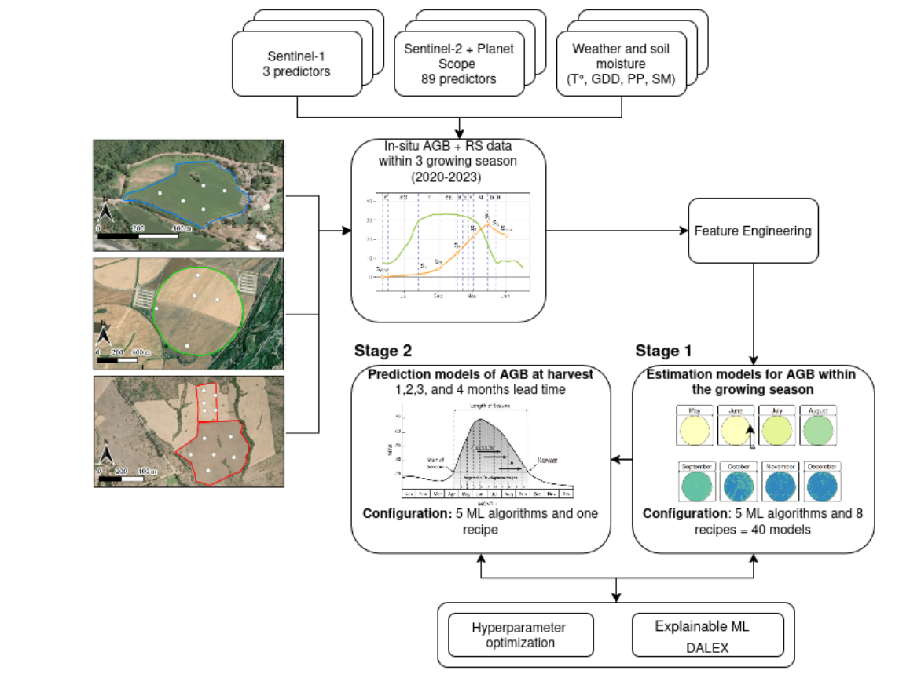
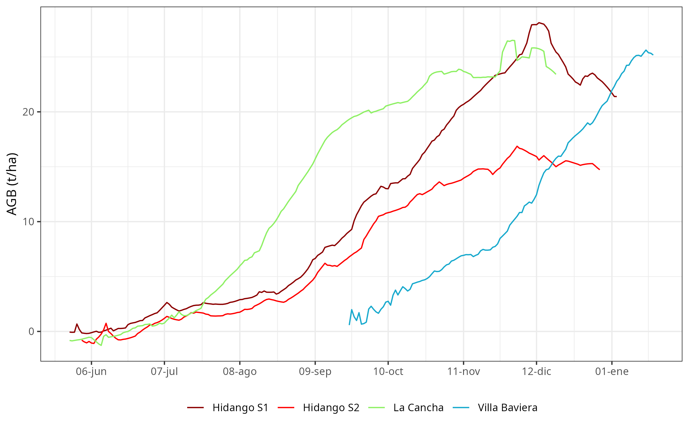

# Introduction

As the world population is projected to reach 9.8 billion by 2050 [@UN2024], food security is expected to face significant challenges [@Bahar2020], which are further intensified by climate change [@Chen2025]. Wheat (*Triticum aestivum*) is the most consumed crop worldwide, and its production is key for food security [@FAO2025]. Furthermore, droughts significantly impact agriculture, as evidenced by the decrease in crop yield [@Santini2022; @Naumann2021; @Mishra2015]. In fact, global wheat production could drop by 13% by mid-century under climate change [@Pequeno2024]. Quantifying above-ground biomass (AGB) is of utmost importance since it allows us to monitor and optimize agricultural processes [@Dietz2021]. Proxies of vegetation productivity derived from vegetation indices can help monitor and predict the impact of drought at a regional scale [@Zambrano2021; @Zambrano2018; @Zambrano2016]. However, on a farm level, we must quantify this impact using crop yield as a productivity metric, which can aid in determining the economic impact of seasonal variations in crop yield. Generally, the estimation and monitoring of agricultural production is made by using three methods: i) crop growth models [@Lobell2010; @Wang2023], ii) surveys [@Gardner1980], and iii) in-situ measurements. The models help predict how crops will grow, yield, and produce under different environmental and management conditions, which is useful for forecasting food supply and understanding how climate change and policy decisions affect global agriculture, but the downside is that they require many different variables to obtain meaningful results. The objective of the surveys is to collect timely and reliable data from the agricultural sector in order to carry out statistical studies of crops, but it provides summaries at administrative units (e.g., states, districts) [@Gardner1980]. Additionally, field measurements provide reliable data---known as the ground truth---that can be used for comparison with models and surveys; however, this process is costly and time-consuming.

The use of empirical models that are based solely on remote sensing sources has become a straightforward option for the estimation of crop yield, especially for cereals [@Lischeid2022]. There are multiple remote sensing methods to estimate AGB, among which the methods based on multispectral imaging [@Marshall2022; @Segarra2022], Synthetic Aperture Radar (SAR) [@Hu2024; @Chao2019], LiDAR (Light Detection and Ranging) [@Bates2021], hyperspectral [@Yue2021], or combination of them [@Li2024; @David2022; @Wang2016], stand out, offering promising results. Estimation methods based on SAR data focus on the measurement of the structure of the crop, soil moisture, and their temporal variations. An advantage of this technique is that it can penetrate the cloud cover, allowing a constant measurement in the study area; its disadvantage is the angle of observation to the crop and the speckle noise inherent to the signal [@Lopes1990; @Maghsoudi2012; @Moran1997]. Estimation methods based on LiDAR and hyperspectral data focus on the measurement of the crop structure and phenological monitoring of the crop [@Brovkina2017; @Luo2017; @Wang2016]. Its main disadvantage is the high cost of implementation, which limits its proliferation. Another common approach is the use of spectral indices (e.g., NDVI, EVI, etc.) derived from optical sensors such as Sentinel-2 [@David2022] for specific dates. Furthermore, the use of accumulated spectral indices [@PeroniVenancio2020] over the growing season has shown improvements in estimating biomass/yield compared with using indices just for specific dates. The main advantage is its simplicity and strong correlation with the observed biomass. Currently, the research about estimating biomass is moving forward integrating Sentinel 1 & 2 [@Uribeetxebarria2023], LiDAR, hyperspectral, and Landsat missions [@Zhang2023; @He2018], which aids in better monitoring of the crop's growth stages [@Shen2023].

Effective machine learning (ML) methods, along with remote sensing data, are increasingly used to estimate the AGB in various cereals, including wheat. In Southern Brazil, [@AtkinsonAmorim2022] collected images from unmanned aerial vehicles (UAV) and used random forest, support vector regressions, and neural networks to estimate AGB in wheat. Their results reached a R² of 0.90 and a root mean square error (RMSE) of 0.83 t/ha. In another study, [@Liu2024] used spectral data obtained from UAV, phenological information, and multiple machine learning algorithms to estimate AGB on wheat, having results of an R² ranging from 0.84 to 0.91 and an RMSE of 1.69 to 2.11 t/ha. Considering another approach, [@Marshall2022] used hyperspectral and Sentinel-2 data and applied random forest and partial least squares to estimate wheat AGB on different stages of the crop. Their results achieve an R²=0.81 and RMSE=3.7 t/ha with the random forest model. Further, for different types of grass cover, Sentinel-1 has been tested to estimate AGB with varied results [@David2022; @Li2024; @Nuthammachot2022]. The benefits of SAR Sentinel-1 are that it can gather dependable data even on cloudy days, which is not possible with optical sensors like Sentinel-2 and Landsat. Additionally, Sentinel-1's backscatter is closely linked to the dielectric constant, making it a proxy of soil moisture [@Fan2025; @Zhu2024], and, therefore, the amount of water crops can absorb from the soil, which affects their growth. Thus, it is worthwhile to explore its usefulness for AGB prediction.

Here, we aim to evaluate ML models to predict wheat AGB at harvest using remote sensing data from missions Sentinel-1 & 2, and PlanetScope, as well as weather and soil moisture in situ measurements. We will test predictions at lead times from one to four months before harvest. We defined three secondary objectives: i) derive predictors from weather, soil moisture, Sentinel-1 & 2, and PlanetScope data; ii) use ML models to estimate the spatiotemporal variation of wheat AGB through the season; and iii) evaluate ML models for the prediction of AGB at four lead times, one to four months before harvest.

# Materials and Methods

## Study Area

The study was conducted during the 2020--2023 growing seasons (June--January) across four wheat field sites (*Triticum* *aestivum*) located in central Chile: i) La Cancha in the Metropolitan region, ii) Hidango in the O'Higgins region (two different fields in two seasons), and iii) Villa Baviera in the Maule region. Sampling took place in delineated fields at each site (Figure @fig-1). In Hidango, separate fields were established for the 2021-2022 and 2022-2023 seasons; in Villa Baviera and La Cancha, sampling occurred during the 2020-2021 and 2022-2023 seasons, respectively. To capture spatial variability and ensure representativeness, sampling points were randomly selected and evenly distributed: five in La Cancha, Villa Baviera, and the first season in Hidango; and six in the second season in Hidango (Figure @fig-1).

{#fig-1 width="100%"}

A variety of spring wheat was planted in Villa Baviera (Llareta-INIA; [@Garrido2013]), while the other sites had winter wheat (Irafen-INIA and Pantera-INIA; [@DelPozo2023]). Spring wheat is typically sown in late winter or early spring and harvested within the same year, whereas winter wheat is sown in autumn, requires vernalization, and is harvested the following summer [@Liu2025; @Zhao2022]. According to the FAO--UNESCO Soil Map of the World [@FAO2014]; La Cancha is characterized by shallow, fine-textured Regosols on nearly flat terrain; Hidango presents fine-textured Luvisols on gently undulating landscapes; and Villa Baviera features deep, well-structured Nitisols on slightly sloped land. The climate in these regions is Mediterranean with winter rainfall (Csb) under the Köppen--Geiger classification [@Beck2023]; Hidango, however, exhibits an oceanic influence. Mean annual precipitation ranges from 700 to 900 mm, with average temperatures between 11 and 12 °C.

## Data acquisition and processing

### Field data

AGB, defined as the total dry mass of dead and living plant organs per unit ground area [@Chave2014], was sampled at distinct wheat phenological stages across each season. Phenological stages were identified using the Zadoks scale, which describes 10 principal growth stages from sowing to ripening [@Zadoks1974]. At each sampling point (Figure @fig-1), biomass from a 0.25 m² area was harvested, dried in a forced-air oven at 70°C for three days, weighed on a precision scale, and converted to t/ha. Sampling intervals were planned to capture variability across growth stages, ensuring representative data for each field and season. The temporal distribution of sampling dates across phenological stages is illustrated in Figure @fig-2, with NDVI time series indicating canopy development over the season. A total of 153 AGB wheat samples were collected: 88 in Hidango (40 in 2021--2022 and 48 in 2022-2023), 35 in La Cancha, and 30 in Villa Baviera.

![**Above-ground biomass (AGB) sampling dates across the seasons and fields.** Zadoks scale, with NDVI included to illustrate changes in canopy vigor throughout the seasons. S = Sowing, SG = Seeding Growth, T = Tillering, SE = Stem Elongation, B = Booting, E = Ear Emergence, F = Flowering, M = Milk Development, D = Dough Development, and R = Ripening. Sampling dates are marked as Sn, where n represents the number of samples collected during the season. S~SOS~ indicates the start of the season (SOS) when AGB = 0, and S~final~ represents AGB at harvest.](../output/figs/fenology_and_biomass_new_v2.png){#fig-2 width="100%"}

Additionally, soil moisture was measured using TEROS 12 sensors (METER Group, USA), which operate via a capacitance/frequency domain method to assess dielectric permittivity, achieving ±1% accuracy in typical mineral soils [@Fragkos2024]. The sensors were installed at a central point within each field's sampling area at depths of 15, 30, and 45 cm in La Cancha and Villa Baviera, and 15, 50, and 75 cm in Hidango in both seasons. Each sensor recorded data at 30-minute intervals, and daily values were computed by averaging the measurements from each day.

Soil water content (cm³/cm³) measured by the sensors was converted to water depth (mm) within the 0--55 cm using the specific depth of the profile at which the sensor was installed.

### Weather Data

Precipitation and temperature data were obtained from automatic meteorological stations managed by the Red Agrometeorológica de Chile. This national network provides continuous, open-access weather data for agricultural use (http://agromet.inia.cl; http://agrometeorologia.cl), recording several meteorological variables at hourly intervals. Each station is equipped with a Texas Electronics TE525MM-L25 tipping-bucket rain gauge for precipitation and a Vaisala HMP60-L11 sensor for air temperature and relative humidity [@ChaconC2019]. For each study site, the nearest meteorological station was selected (Table @tbl-1), and hourly precipitation and air temperature data were downloaded starting from the sowing date.

| **Field** | **Nearest station** | | | | |
|-----------|---------------------|---------------------------|-----------------------------|-----------------------------|-----------------------------|
|           | **EMA code**        | **Name**                  | **Institution**             | **Coordinates**             | **Distance to field (km)**  |
| Hidango   | 260                 | Hidango                   | INIA                        | 34.1°S; 71.8°W              | 1.03                        |
| La Cancha | 50                  | Chocalan                  | FDF                         | 33.73°S; 71.21°W            | 1.16                        |
| Villa Baviera | 103                 | Parral Norte              | FDF                         | 36.23°S; 71.73°W            | 20.89                       |

: Meteorological stations for each field. {#tbl-1}

Daily precipitation (mm) was cumulatively summed over the growing season to obtain daily accumulated precipitation (mm, ∑PP). Daily minimum (Tmin) and maximum (Tmax) temperatures were used to compute Growing Degree Days (GDD):

$$GDD  =  \frac{\left( T_{\max} + T_{\min} \right)}{2} - T_{base}$$

A base temperature of 2°C was applied for the early growth stages (sowing to tillering), while 6°C was used for reproductive stages (stem elongation to ripening) [@DelPozo1987]. Negative GDD values were set to zero. Then, the accumulated GDD values were calculated by summing the daily GDD from the start of the season of each field (∑GDD).

### Remote Sensing Data

Satellite time series imagery from three missions---Sentinel-1, Sentinel-2, and PlanetScope---were used to derive predictors for aboveground biomass (AGB) modeling. These datasets include radar and optical sensors, covering different spectral ranges (SAR, visible, NIR, SWIR) and having different spatial resolutions.

The Sentinel‑1 (S1) mission, operated by the European Space Agency (ESA), consists of a constellation of C-band synthetic aperture radar (SAR) satellites that operate in several acquisition modes (Interferometric Wide---IW, Extra Wide---EW, and Stripmap---SM), with spatial resolutions ranging from 5 to 40 m and a swath width up to 410 km. Data acquisition is independent of cloud cover or sunlight, enabling consistent time-series generation under any weather condition. We used Level‑1 Ground Range Detected (GRD) products from Sentinel‑1A (S1A), the only satellite of the constellation operational during the study period, as Sentinel‑1B stopped transmitting in 2022 and Sentinel‑1C was not yet launched. GRD products are radiometrically calibrated, multi-looked, and terrain-corrected using a digital elevation model, then projected to the WGS84 datum (Table @tbl-2). These products are delivered in dual-polarization (VV, VH or HH, HV), depending on the acquisition mode and region, with a pixel spacing of 10 to 40 m [@Torres2012].

Sentinel‑2 (S2) is a dual-satellite optical mission carrying the MultiSpectral Instrument (MSI), which captures 13 spectral bands across the visible, near-infrared (NIR), and shortwave infrared (SWIR) regions. Spatial resolution varies by band (10, 20, or 60 m), and the system provides global coverage with a revisit time of ~5 days at the Equator. We used Level‑2A surface reflectance products, which are atmospherically corrected (bottom-of-atmosphere, BOA) and orthorectified (Table @tbl-2). These products include cloud and shadow masks, aerosol optical thickness (AOT), and water vapor content layers, along with scene classification maps and pixel-level quality information [@Drusch2012].

| **Dataset** | **Collection** | **Bands** | **Central wavelength (nm)** | **Resolution** | | |
|-------------|----------------|-----------|-----------------------------|----------------|----------------|----------------|
|             |                |           |                             | **Spatial (m)** | **Revisit (days)** |
| Sentinel-1  | Ground Range Detected (GRD) | VV        | 5.546×10^7^ (C-Band)        | 10             | 6              |
|             |                | VH        | 5.546×10^7^ (C-Band)        | 10             |                |
| Sentinel-2  | Level-2A       | 1 - Coastal aerosol | 442.7 (A) / 442.2 (B) | 60             | 5              |
|             |                | 2 - Blue  | 492.7 (A) / 492.3 (B)       | 10             |                |
|             |                | 3 - Green | 559.8 (A) / 558.9 (B)       | 10             |                |
|             |                | 4 - Red   | 664.6 (A) / 664.9 (B)       | 10             |                |
|             |                | 5 - Vegetation Red Edge (RE~1~) | 704.1 (A) / 703.8 (B) | 20 |                |
|             |                | 6 - Vegetation Red Edge (RE~2~) | 740.5 (A) / 739.1 (B) | 20 |                |
|             |                | 7 - Vegetation Red Edge (RE~3~) | 782.8 (A) / 779.7 (B) | 20 |                |
|             |                | 8 - NIR   | 832.8 (A) / 832.9 (B)       | 10             |                |
|             |                | 8A - Vegetation Red Edge | 864.7 (A) / 864.0 (B) | 20 |                |
|             |                | 9 - Water vapour | 945.1 (A) / 943.2 (B) | 60 |                |
|             |                | 10 - SWIR - Cirrus | 1373.5 (A) / 1376.9 (B) | 60 |                |
|             |                | 11 - SWIR (SWIR~1~) | 1613.7 (A) / 1610.4 (B) | 20 |                |
|             |                | 12 - SWIR (SWIR~2~) | 2202.4 (A) / 2185.7 (B) | 20 |                |
| PlanetScope | Level 3B Surface Reflectance (SR) | 1 - Coastal Blue | 441.5 | 3 | 1 |
|             |                | 2 - Blue  | 490               | 3             |                |
|             |                | 3 - Green I | 531               | 3             |                |
|             |                | 4 - Green | 565               | 3             |                |
|             |                | 5 - Yellow | 610               | 3             |                |
|             |                | 6 - Red   | 665               | 3             |                |
|             |                | 7 - Red Edge | 705               | 3             |                |
|             |                | 8 - NIR   | 865               | 3             |                |

: Summary of satellite data used to derive predictors for AGB estimation. {#tbl-2}

PlanetScope (PS) is a commercial constellation of ~120 CubeSats operated by Planet Labs, which capture daily multispectral imagery at a nominal resolution of 3 m. The constellation includes different sensor types deployed over time, such as Dove-C (three- or four-band imagers with a split-frame NIR filter), Dove-R (four-band imagers with a butcher-block filter), and SuperDove (eight-band imagers including the visible, NIR, and Red Edge bands). We used Level‑3B Surface Reflectance products, which are orthorectified and atmospherically corrected using Planet's in-house model based on global aerosol assumptions. Although not fully corrected for haze or thin cirrus clouds, the products are radiometrically calibrated, georeferenced to sub-pixel accuracy, and delivered with metadata and quality indicators [@Roy2021]. Due to the sensor transition that occurred during the study period, both Dove and SuperDove imagery were included. To ensure consistency across the dataset, only the four bands common to all sensor types (Blue, Green, Red, and NIR) were used.

S1 Ground Range Detected (GRD) imagery was accessed via Google Earth Engine; S2 Level-2A products were obtained from the Planetary Computer; and PS imagery was acquired through the Planet Explorer platform, excluding images with cloud cover over the fields. A total of 185 S1, 208 S2, and 180 PS images were used across the four fields in their respective seasons: Hidango 2021-2022 (S1: 52; S2: 60; PS: 47), Hidango 2022-2023 (S1: 56; S2: 56; PS: 40), La Cancha 2022-2023 (S1: 43; S2: 53; PS: 41), and Villa Baviera 2020-2021 (S1: 34; S2: 39; PS: 52).

### Preprocessing of remote sensing data

For data preprocessing, Sentinel-1 backscatter values (VV and VH) were first converted from decibels to linear scale, and the VH/VV polarization ratio was then computed. No additional masking was applied to Sentinel-1, as its GRD products undergo standard preprocessing, including radiometric calibration, multi-looking, and orthorectification. For Sentinel-2 and PlanetScope, reflectance values were scaled by dividing by 10,000, and values outside the [0.01, 1] range were discarded. Low-quality Sentinel-2 pixels were identified using the Scene Classification Layer (SCL), excluding classes 0, 1, 2, 3, 8, 9, and 10. For PlanetScope, the Universal Data Mask (UDM) was used to retain only clear-sky pixels.

All variables were interpolated to create continuous daily time series, ensuring they aligned with AGB sampling dates and allowing for biomass estimation at consistent temporal offsets across different fields and seasons. For Sentinel-1, VV, VH, and VH/VV ratio were temporally extended by duplicating each acquisition across the days until the midpoint to the following observation. For Sentinel-2 and PlanetScope, spectral bands were interpolated using a Kalman smoothing approach [@Moritz2017], and cumulative sums were computed from the start of each season. Daily values from all sources, and cumulative sums for Sentinel-2 and PlanetScope, were extracted at sampling locations and later used as input variables for AGB estimation.

### Selection and processing of VIs

A total of 53 vegetation indices (VIs) were selected to estimate AGB using the daily interpolated S2 and PS data (Table @tbl-3). Daily cumulative sums of these VIs were also computed from the start of each season to capture integrated vegetation dynamics. Furthermore, 36 of these 53 VIs originally derived from the B8 band were recalculated using the B8A band (available only for S2) to assess potential differences in vegetation response between these two near-infrared bands, resulting in a total of 89 VIs across both products. The indices were chosen based on their relevance for assessing vegetation status, biomass estimation, and yield prediction in wheat, forage, maize, and similar crops [@Peng2023; @Segarra2022; @Uribeetxebarria2023; @Wang2022; @Wu2008; @Zheng2017]. Both daily values and cumulative VIs were used as predictor variables in the modeling framework.

Table @tbl-3 outlines the vegetation indices (VIs) chosen for the machine learning (ML) model after eliminating those that were highly correlated. To see all the other VIs that were used, please refer to the Supplementary Material Table S1.

| N° | Dataset used | Name | Abbreviation | Formula | Reference |
|----|--------------|------|--------------|---------|-----------|
| 1 | S2 | OSAVI Variant | OSAVI~2~ | $\frac{1.16 \cdot (RE3 - Red)}{(RE3 + Red + 0.16)}$ | @Jin2020 |
| 2 | S2 | - | MCARI/OSAVI~2~ | $MCARI/{OSAVI}_{2}$ | @Wu2008 |
| 3 | S2 | SWIR 11 Related MCARI | MCARI~SWIR11~ | $(\left( RE_{1} - SWIR_{1} \right) - 0.2 \cdot (RE_{1} - Green)) \cdot (RE_{1}/SWIR_{1})$ | @Herrmann2011 |
| 4 | S2 | SWIR 11 Related TCARI | TCARI~SWIR11~ | $3 \cdot ((RE_{1} - SWIR_{1}) - 0.2 \cdot (RE_{1} - Green) \cdot (RE_{1}/SWIR_{1}))$ | @Herrmann2011 |
| 5 | S2 | SWIR 12 Related MCARI | MCARI~SWIR12~ | $(\left( RE_{1} - SWIR_{2} \right) - 0.2 \cdot (RE_{1} - Green)) \cdot (RE_{1}/SWIR_{2})$ | @Herrmann2011 |
| 6 | S2* | Normalized Difference Red-edge Index 3 | NDRE3 | $(NIR - RE_{3})/(NIR + RE_{3})$ | @Magney2017 |
| 7 | S2* | Water Index | WI | $NIR/Water\ vapour$ | @Jin2020 |
| 8 | S2 - PS | Modified Chlorophyll Absorption in Reflectance Index | MCARI | $(\left( RE_{1} - Red \right) - 0.2 \cdot (RE_{1} - Green)) \cdot (RE_{1}/Red)$ | @Daughtry2000 |
| 9 | S2 - PS | Transformed Chlorophyll Absorption in Reflectance Index | TCARI | $3 \cdot ((RE_{1} - Red) - 0.2 \cdot (RE_{1} - Green) \cdot (RE_{1}/Red))$ | @Haboudane2002 |
| 10 | S2 - PS | - | TCARI/OSAVI | $TCARI/OSAVI$ | @Haboudane2002 |
| 11 | S2 - PS | - | MCARI/OSAVI | $MCARI/OSAVI$ | @Daughtry2000 |
| 12 | S2* - PS | Simple Ratio | SR | $NIR/Red$ | @Tucker1979 |
| 13 | S2 - PS | Optimized Soil-Adjusted Vegetation Index | OSAVI | $\frac{1.16 \cdot (NIR - Red)}{(NIR + Red + 0.16)}$ | @Rondeaux1996 |
| 14 | S2 - PS | Chlorophyll Index - Red | CI~red~ | $(NIR/Red) - 1$ | @Clevers2013 |
| 15 | S2 - PS | Chlorophyll Vegetation Index | CVI | $(NIR/Green) \cdot (Red/Green)$ | @Vincini2008 |
| 16 | S2 - PS | Enhanced Vegetation Index | EVI | $\frac{2.5*(NIR - Red)}{((NIR + 6*Red - 7.5*Blue) + 1)}$ | @Jiang2008 |
| 17 | S2 - PS | Normalized Difference Vegetation Index | NDVI | $(NIR - Red)/(NIR + Red)$ | @Rouse1974 |
| 18 | S2 - PS | Green NDVI | GNDVI | $(NIR - Green)/(NIR + Green)$ | @Gitelson1996 |
| 19 | S2 - PS | Normalized Difference Red-edge Index 1 | NDRE1 | $(NIR - RE_{1})/(NIR + RE_{1})$ | @Magney2017 |
| 20 | S2 - PS | - | NDRE/NDVI | $NDRE_{1}/NDVI$ | @Raper2015 |
| 21 | S2 - PS | Structure Insensitive Pigment Index | SIPI | $(NIR - Blue)/(NIR - Red)$ | @Penuelas1994 |

: Vegetation indices (covariates) derived from Sentinel-2 (S2) and PlanetScope (PS) spectral bands. Asterisk (*) next to the S2 dataset indicates that the index was also recalculated using Sentinel-2 Band 8A (narrow NIR) instead of Band 8 (broad NIR). {#tbl-3}

## Modeling with Machine Learning Algorithms

### Overview of the modeling process

{#fig-3 width="100%"}

Figure @fig-3 shows a general scheme for the modeling process. The dataset for modeling is composed of the in situ AGB data and the remote sensing predictors derived from S1, S2, and PlanetScope, as well as the weather variables. All this data is generated as a time series for each growing season in each site. Then a feature engineering process is applied to the data before running the models. Thereafter, the dataset is used in the first stage to run the ML models to estimate the spatio-temporal variation of AGB within the growing season. After achieving the initial results, we tested the ML prediction models of AGB at harvest by using covariates from four lead times: 1, 2, 3, and 4 months. The ML models for estimation and prediction pass through a hyperparameter optimization and an explainable ML process.

We tested five machine learning (ML) algorithms to estimate spatio-temporal in-season and AGB (stage 1) and to predict AGB at harvest (stage 2): extreme gradient boosting (XGBoost; [@Chen2016]), random forest (RF; [@Ho1995]), regularized generalized linear regression (GLMnet; [@Hastie2015]), single layer, feed-forward neural networks (bagMLP; [@Breiman1996a]), and K-nearest neighbors (KNN; [@Hechenbichler2004]). We also tested an ensemble model which combines the predictions for the five models [@Breiman1996b; @Wolpert1992]. These models were selected based on their robustness in regression tasks, capacity to handle high-dimensional data, interpretability, and for being state-of-the-art.

### Defining dataset recipes for estimation and prediction models

The dataset used for the estimation modeling (stage 1) included covariates derived from soil moisture data, weather variables, remote sensing spectral information, and VIs. The response variable was AGB (t/ha), obtained from field measurements. As a first step, we divided the data into a training and testing dataset; we chose 75% of the data for training and the remaining 25% for testing. Further, we split the predictor variables into different subsets with the aim to evaluate independently how the weather, Sentinel-1, Sentinel-2, and PlanetScope contribute to the estimation of AGB. We called each subset a recipe (rec). Thus, *rec1* used all the variables, *rec2* uses only Sentinel-2, *rec3* uses Sentinel-2 and weather, *rec4* uses PlanetScope, *rec5* uses PlanetScope and weather, *rec6* uses Sentinel-1, *rec7* uses Sentinel-1 and weather, and *rec8* uses only weather variables.

### Feature engineering

Before running the ML modeling for estimation and prediction, we applied different preprocessing methods to the dataset. First, to fill missing data, we imputed it using k-nearest neighbor [@Gower1971]. All of the predictors were then normalized to have a standard deviation of one and a mean of zero. Also, we applied a filter to eliminate highly correlated variables.

### Estimation models for AGB within the growing season

For the estimation model (stage 1), covariates from the same day as the AGB measured in situ were employed. Thus, we generate a modeling dataset by including the value of the covariates for each sample point. We used a combination of 40 models, corresponding to the eight recipes multiplied by the five ML algorithms. We then ran the models, tuned them through hyperparameter optimization (see section 2.3.4), and used them to estimate AGB spatially for each day and site during the growing season. This process yields a daily spatiotemporal dataset of AGB for each site.

### Prediction models for AGB at harvest

From the estimation modeling (stage 1), we obtained the daily spatio-temporal AGB within the growing season. For prediction, we took the AGB of the harvest date per site as the response variable. As covariates, we selected the remote sensing covariates (S1, S2, and PS variables in Table @tbl-3) and weather data, which lagged from one to four months before harvesting as lead time. To generate the dataset for prediction modeling, we took 100 random samples per site for the responses and covariates. In the modeling process, we used hyperparameter optimization to enhance the performance of our models and then applied them to predict aboveground biomass (AGB) at harvest for each lead time.

### Hyperparameter optimization and evaluation

To tune each parameter per algorithm for the estimation and prediction modeling, we used hyperparameter optimization, defining ten candidates per parameter. Table @tbl-4 shows the parameters tuned and their descriptions. For evaluating the models performance, we used cross-validation as a resampling technique (on the training dataset). We used k-fold cross-validation, with k=5 for five folds. We tune the parameters for each fold and then evaluate the model performance in the k-1 fold ten times. In this case, we define no repetitions per fold. The final evaluation of the model was made in the test dataset (25%). We used the mean absolute error (MAE), root mean square error (RMSE), and r-squared (R²) metrics (see Supplementary Material Eqs. S1, S2 & S3).

| **Parameter** | **Description** | **Algorithm** |
|---------------|-----------------|---------------|
| trees* | An integer for the number of trees contained in the ensemble. Fixed to 1000 trees. | XGBoost, RF |
| tree_depth | An integer for the maximum depth of the tree. | XGBoost, RF |
| min_n | An integer for the minimum number of data points in a node that is required for the node to be split further. | XGBoost, RF |
| loss_reduction | A number for the reduction in the loss function required to split further. | XGBoost |
| sample_size | A number for the number (or proportion) of data that is exposed to the fitting routine. | XGBoost |
| learn_rate | A number for the rate at which the boosting algorithm adapts from iteration-to-iteration. | XGBoost |
| cost | A positive number for the cost of predicting a sample within or on the wrong side of the margin | XGBoost |
| penalty | A non-negative number representing the total amount of regularization. | GLMnet, bagMLP |
| mixture | A number between zero and one (inclusive) denoting the proportion of L1 regularization (i.e. lasso) in the model. | GLMnet |
| hidden units | An integer for the number of units in the hidden model. | bagMLP |
| epochs | An integer for the number of training iterations. | BagMLP |
| neighbors | The number of neighbors to consider (often called k) | KNN |
| weight_func | A single character for the type of kernel function used to weight distances between samples. | KNN |
| dist_power | A single number for the parameter used in calculating Minkowski distance. | KNN |

: Parameters per machine learning algorithm. RF: random forest. XGBoost: extreme gradient boosting. GLMnet: regularized generalized linear regression. BAGmlp: single layer, feed-forward neural networks. KNN: k-nearest neighbour. *This parameter was not tuned. {#tbl-4}

### Explainable Machine Learning with DALEX

To assess the contribution of each covariate to the model's performance, we performed a variable importance analysis. Further, to evaluate how the most important variables impact the model's predictions, we used partial dependence plots. For this, we used the DALEX (moDel Agnostic Language for Exploration and eXplanation). DALEX provides a model-agnostic framework for interpreting machine learning models by quantifying the impact of individual variables on model predictions. We computed permutation-based variable importance, which evaluates the increase in prediction error after permuting the values of a given variable while keeping all other variables fixed. This approach captures both main effects and interactions and is applicable across diverse model types. For estimation, we analyzed the ensemble model that used all the predictors (recipe *rec1*), and for prediction, we used the best model for each lead time. For each variable, we calculated the increase in root mean squared error (ΔRMSE) caused by the permutation. Higher ΔRMSE values indicate greater importance of the corresponding variable to model performance. The analysis was repeated over 50 random permutations to ensure stability of the importance rankings. The top predictors were identified by ranking variables based on the mean ΔRMSE. In addition, we calculated a "scaled dropout loss" metric to compare variable influence across lead times in the prediction models.

## Software

We utilized the R programming language [@RCoreTeam2025] for processing satellite data, as well as for data analysis, ML modeling, and visualization. To access satellite data, we employed the {earthdatalogin} package [@Boettiger2023]. For smoothing the time series of vegetation indices, we applied the {imputeTS} package [@Moritz2017]. We used the {terra} package [@Hijmans2023] and the {sf} package [@Pebesma2018] for processing raster and vectorial data. For data science tasks and visualization, we utilized the {tidyverse} suite [@Wickham2019]. For machine learning modeling, we work with the {tidymodels} framework [@Kuhn2020]. For the variable importance we used {DALEX} [@Biecek2018]. The {tmap} package [@Tennekes2018] was employed for mapping purposes.

# Results

## Estimation model for AGB within the growing season

### Selecting the best models

For AGB estimation, we tested 40 models generated by a combination of machine learning algorithms and the type of predictors used (recipes). The performance for all the models had R² values above 0.65, MAE below 5 t/ha, and RMSE below 6.5 t/ha. Figure @fig-4 shows the ranking of the 40 models based on the R², using the training dataset obtained through resampling. The algorithms RF, followed by XGBoost, were the ones that achieved the best (higher R² and lower error), and GLMnet had the lowest performance. The recipe *rec3*, which uses S1 and weather, ranks first*,* followed by *rec6,* which uses S2 and weather, and *rec1*, which incorporates all the covariates. The algorithm that had the poor performance was the GLMnet with *rec4*, using only weather, and with *rec3,* which uses S1 and weather.

{#fig-4 width="100%"}

We then select the three models that achieved the highest performance, along with the ensemble model, and run all of them on the testing dataset. The resulting metrics between the models were similar; however, the ensemble model had a higher error (RMSE=3.65 t/ha and R²=0.89), while the RF with *rec3* (S1+W) had a lower error and a higher R² (Figure @fig-5) with RMSE=3.18 t/ha, and R²=0.91.

{#fig-5 width="100%"}

### Explainable Machine Learning with DALEX

{#fig-6 width="100%"}

The results of the most important variables identify the ∑GDD as the one that has a higher impact on the estimation model performance. The SAR-derived indices S1~VH~, S1~VV~, and S1~VH/VV~ follow, with the weather variables of SM and PP showing a higher impact on the estimation model (Figure @fig-6). The weather variables are retrieved from weather stations and are not represented spatially, unlike the S1, which has spatial representation. The predictors derived from optical sensors (S2 and PS) are the ones that reached the lowest impact on the model estimations.

{#fig-7 width="100%"}

Partial dependence plots (Figure @fig-7) from the ensemble model reveal complex, often non-linear relationships between key S1 SAR-derived and environmental features and the predicted outcome. Cumulative growing degree-days (ΣGDD) exert a strong positive influence that steepens beyond ~600--700 GDD and approaches a plateau above 1000 GDD, whereas the ΣPP exhibits a clear optimum between approximately 100 and 300 units, with a moderate decline at higher values. Early-season backscatter dynamics in VH polarization (S1~VH~), strongly enhance predictions across its range, reflecting rapid canopy development or high biomass periods. In contrast, prolonged periods of low VH backscatter (S1~VH~) and elevated soil moisture (SM) during sensitive phases impose marked yield penalties, likely linked to delayed emergence or waterlogging risk. The S1~VH/VV~ displays an optimum near 0.2--0.4, indicating a beneficial balance of vegetation versus soil-dominated scattering. Together, these profiles demonstrate the model's ability to capture subtle, non-monotonic interactions among thermal accumulation, radiation, soil moisture, and Sentinel-1 VH and VV polarization signals that drive variation in the AGB.

### Spatio-temporal variation of AGB within the growing season

Finally, we run the models to make a daily spatial estimation of biomass through the growing season at each site. The averaged daily AGB for each site is shown in Figure @fig-8, along with the in-situ AGB measurements.

{#fig-8 width="100%"}

The estimation adjusted well for Hidango in both seasons but underestimated in La Cancha from the middle of the season on. For Villa Baviera, the model estimates well for most of the season, but at the end shows an overestimation. In Figure @fig-9, we show the monthly average of AGB per site. In Hidango season 2021-2022 and in La Cancha, the AGB goes from below 2 t/ha to up to 30 t/ha. In Hidango season 2022-2023, the AGB was lower, reaching 22.50 t/ha. In Villa Baviera, the wheat variety has a shorter season, from September to January; the AGB at harvest was up to 30 t/ha. The sites that showed the higher spatial variability were Hidango season 2022-2023 and La Cancha (Figure @fig-8 and @fig-9).

{#fig-9 width="100%"}

## Prediction models for AGB at harvest

The prediction models were evaluated for lead times of one, two, three, and four months. The R² value decreases from 0.94 at one month to 0.86 at four months. Concurrently, the errors increase, with the MAE rising from 0.85 t/ha and the RMSE from 1.11 t/ha at one month, to MAE of 1.26 t/ha and RMSE of 1.74 t/ha at four months (Figure @fig-10).

{#fig-10 width="100%"}

Table @tbl-5 presents the six most significant variables for the four lead time prediction models. Soil moisture (SM) was the leading covariate in three instances. Monthly cumulative precipitation was ranked first for one of the prediction lead times. Covariates derived from Sentinel-1, specifically backscatter VV and VH/VV, as well as VH, ranked second across all four lead times. Additionally, only one optical covariate from the PlanetScope satellite, band three (B3), was ranked fifth for all four lead times.

| **Variable** | **N** | **Mode rank** | **Scaled dropout loss** |
|--------------|-------|---------------|--------------------------|
| **SM** | 3 | 1 | 1.78 |
| ∑PP | 1 | 1 | 1.78 |
| **S1~VV~** | 4 | 3 | -0.403 |
| **S1~VH/VV~** | 4 | 3 | -0.455 |
| **S1~VH~** | 4 | 2 | -0.355 |
| PS~B3~ | 4 | 5 | -0.567 |

: The six most important variables for the XGBoost prediction model (extreme gradient boosting) and rec1 (all predictors). N: the times that the variable was in the five most important variables. Mode rank: This refers to the statistical mode of the ranks assigned to the variable. Scaled dropout loss: the average value of the scaled dropout. This statistic considers the summary for the four prediction lead times. {#tbl-5}

# Discussion

## Models performance

For the estimation, the RF and XGBoost models achieved high R² values (>0.9) and low errors (RMSE ~3.2 t/ha) for AGB on the test dataset, indicating excellent potential generalization capacity. The results are similar to other studies that used UAV with higher spatial resolution [@AtkinsonAmorim2022; @Liu2024] and others that used hyperspectral data with wider spectral information [@Marshall2022]. The recipes that allowed a higher performance were those using S1 and weather data. The meteorological variables ∑GDD was the most important predictor as expected and has been shown by [@Liu2025]. ∑PP, SM were the following most influential weather predictors in the models, which confirms water availability's fundamental role in crop development. Although weather allows capturing the temporal behavior, they do not reflect the spatial variation on AGB. The mix of weather data and satellite information, especially SAR variables (VH, VV, and VH/VV), had a big effect, proving they are advantageous in areas with many clouds and making S1 a strong addition to optical sensors. It is likely that the results obtained with S1 are supported by its outstanding agreement with the soil dielectric constant, which at the same time is linked to soil moisture variation [@Wang2023]. Despite having a higher spatial resolution, PS has a minor influence on the model response, as does S2, despite its wider spectral resolution.

We tested the prediction at four lead times; however, the major drawback of this is the low variability of AGB at harvest, because we used only four sites. Nevertheless, the prediction showed a decrease in R² with increasing lead time, from 0.94 (1 month) to 0.86 (4 months). This decrease suggests the increasing difficulty of capturing interannual variability and extreme weather events in advance. However, the results are promising for practical implications for early decision-making. Soil moisture content (SM) was the most relevant variable for three of the four lead times, reaffirming its role as an early indicator of water stress and the well-known interconnection of soil-plant-atmosphere. Only one PS band was significant among the six main covariates. This finding could be attributed to the saturation of optical indices in advanced stages of crops or the high redundancy between accumulated VIs.

## Application for wheat yield management

The ability to predict AGB with a horizon of up to four months can facilitate irrigation, fertilization, and crop insurance decisions. It is also useful for government agencies in yield monitoring and food security. Incorporating multi-temporal forecasts would allow for the construction of warning systems for low-yield events before harvest. Further, the satisfactory results obtained from S1 suggest that the model is likely to have adequate performance in regions that face cloudy weather during the growing season.

In contrast to other methodologies that rely on UAVs or hyperspectral data, this approach offers many advantages. One of the most important is the lower cost in equipment and human resources. The public data (S1, S2, and weather) makes the real-time application scalable, allowing for easy expansion to other agroclimatic regions. Thus, a decision support system for yield variation could potentially be implemented, considering minor investments.

## Study limitations

Although accurate, the data come from weather stations within or near the fields. In regional or replicable applications, performance would need to be evaluated using weather satellite data (e.g., CHIRPS, ERA5). Additionally, soil moisture (SM) was often the most important variable; however, it posed a challenge because many farmers do not measure it. Nevertheless, the advance in soil moisture estimation from satellites at farm scale would help to address this issue [@VanHateren2023; @Zeyliger2022]. Such approaches would facilitate generalization.

Another limitation is that the study is based on three locations in central Chile with different wheat varieties (winter and spring). For a well-evaluated generalization, the models need to be fed with more data that allows them to be tested in independent sites and seasons. The future direction of the study should move toward expanding the AGB dataset. However, in Chile, reliable and publicly available information on wheat AGB at the farm scale is lacking.

Other concerns include the speckle noise from Sentinel-1 and its dependence on the angle of incidence, which may make achieving consistent results across different landscapes or farming situations challenging. Finally, the use of cumulative VIs, although useful, could lead to redundancy among predictors. Future research could explore more aggressive variable selection.

# Conclusion

In this study, we used 40 models in a combination of datasets called recipes (weather, S1, S2, and Planet Scope) and ML algorithms to estimate AGB in wheat within the growing season (stage 1), and the results were very similar to the ensemble model. The models that reached a higher performance were those based on decision trees, highlighting RF and XGBoost. The recipes that improve performance are those that combine S1 and weather predictors (rec3). The variables that stand out are GDD and indices derived from S1, followed by cumulative precipitation and soil moisture, and the indices derived from S2 have minor importance.

The models for prediction of AGB at harvest (stage 2) are complex because there are only four sites in three locations, limiting AGB variability. Nevertheless, the model reaches an R² of 0.94 at a one-month lead time, which decreases to 0.84 at a four-month lead time. In this case, GDD did not show importance because, at harvest, there is low GDD variability. Thus, PP, SM, and indices derived from S1 were highlighted.

Despite the prediction models raising some challenges for generalization, the results are promising. The combination of SAR S1 indices under cloudy environments with weather data will allow filling the gaps where the optical sensor fails. Future works should focus on generalization, for example, by replacing in situ weather data with satellite estimates and increasing the collection of in situ AGB data.

# Acknowledgements

Chile's National Research and Development Agency (ANID) funded this study through the grants Fondecyt Iniciación N°11190360, FONDEF IdEA I+D ID21I10297, and the drought emergency FSEQ210022. Also, we thank the researcher Dr. Christian Alfaro from the Instituto de Investigaciones Agropecuarias (INIA) from Chile for his support and for providing access to the wheat fields. We also thank Professor Francisco Tapia from Universidad Mayor for his support and his knowledge about wheat development during this research. Finally, we thank Mr. Fabian Llanos, who coordinated the field trips that allowed us to collect the wheat biomass in situ data.

# Data and code availability

The data and code used for the analysis and modeling of above-ground biomass (AGB) in wheat fields is openly available at the following GitHub repository: <https://github.com/FONDECYT-11190360/AGB_wheat_modelling>. This repository contains data, R scripts and documentation for data preprocessing, model development, variable importance analysis, and visualization.

# CRediT authorship contribution statement

**Francisco Zambrano**: Project administration, Funding acquisition, Formal analysis, Conceptualization, Methodology, Writing - Original Draft, Writing - Review & Editing, Visualization. **Abel Herrera**: Formal Analysis, Data curation, Visualization, Writing - Original Draft, Writing - Review & Editing. **Mauricio Molina-Rocco:** Conceptualization, Writing - Original Draft, Writing - Review & Editing.

# Declaration of competing interest

The authors declare that they have no known competing financial interests or personal relationships that could have appeared to influence the work reported in this paper.

# Funding Sources

Chile's National Research and Development Agency (ANID) funded this study through the grants Fondecyt de Iniciación N°11190360, FONDEF IdEA I+D ID21I10297, and the drought emergency FSEQ210022. We also like to thank the Instituto de Investigaciones Agropecuarias (INIA), the enterprises Ariztia, and Villa Baviera for giving access to the fields of wheat.

# Declaration of generative AI and AI-assisted technologies in the writing process

During the preparation of this work, the authors used ChatGPT-3.5 and Microsoft Copilot to polish the writing of the manuscript. After using this service, the authors reviewed and edited the content as needed and took full responsibility for the publication.

# Glossary

| **Abbreviation / Term** | **Definition** |
|-------------------------|----------------|
| AGB | Above-Ground Biomass. The total mass of living plant material (excluding roots) in a given area, typically measured in tons per hectare (t/ha). It is the primary dependent variable being modeled and forecasted. |
| ML | Machine Learning. A subset of artificial intelligence that provides systems with the ability to automatically learn and improve from experience without being explicitly programmed. |
| SAR | Synthetic Aperture Radar. A type of radar used in satellite remote sensing (e.g., Sentinel-1) that transmits microwaves and records the backscattered signal, providing data related to surface roughness and moisture, independent of weather and light conditions. |
| S1 | Sentinel-1. The European Space Agency (ESA) satellite mission providing C-band Synthetic Aperture Radar (SAR) data. Used for monitoring land and ocean surface dynamics. |
| S2 | Sentinel-2. The European Space Agency (ESA) satellite mission providing high-resolution optical imagery (13 spectral bands). Used for land cover classification and vegetation monitoring. |
| PlanetScope | A constellation of Earth-observing satellites operated by Planet Labs. They provide daily, high-resolution optical imagery, complementing the temporal resolution of Sentinel missions. |
| In-Situ Data | Data collected directly at the field location, involving physical measurement. In this study, this primarily refers to collected weather variables and soil moisture measurements. |
| GDD | Growing Degree Days. A measure of heat accumulation used to predict the rate of plant development between growing stages (phenological stages). It is calculated based on daily maximum and minimum air temperatures. |
| XGBoost | eXtreme Gradient Boosting. A highly optimized and efficient open-source implementation of the gradient boosting framework, popular for its speed and performance in structured data prediction. |
| GLMnet | Generalized Linear Model with regularization. A model that applies regularized regression (L1/L2 penalties) to linear models, often used for variable selection and preventing overfitting. |
| KNN | k-Nearest Neighbors. A non-parametric supervised learning method used for classification and regression. The output is based on the classification or mean value of its nearest neighbors. |
| bagMLP | Bagged Multilayer Perceptron. An ensemble learning technique where multiple Multilayer Perceptron (neural network) models are trained on different subsets of the data (bagging), and their predictions are averaged. |
| Cross-Validation | A statistical technique used to estimate how accurately a predictive model will perform in practice. It involves partitioning the data into subsets for training and testing. |
| R² | Coefficient of Determination. A statistical measure representing the proportion of the variance for a dependent variable that is explained by the independent variables in a regression model. A value closer to 1 indicates a better fit. |
| RMSE | Root Mean Square Error. A measure of the average magnitude of the errors. It tells you how concentrated the data is around the line of best fit. It has the same units as the dependent variable (t/ha). |
| DALEX | moDel Agnostic Language for Exploration and eXplanation. A specific framework or library used in this research to provide model-agnostic tools for explaining the behavior of complex ML models (contributing to XAI). |